The Home Invaders
===

Description
---
Household organizers inspired by the classc game Space Invaders. 

The arcade game would only hold you up for quarters but these aliens will also hold up your keys, wallet, phone, pocket knife, headphones, etc....

| 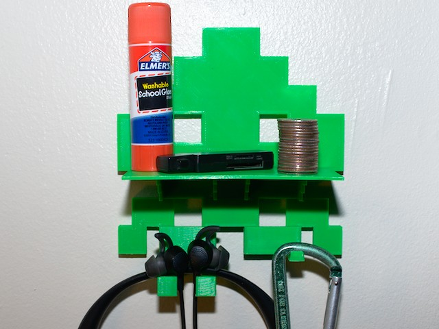 | 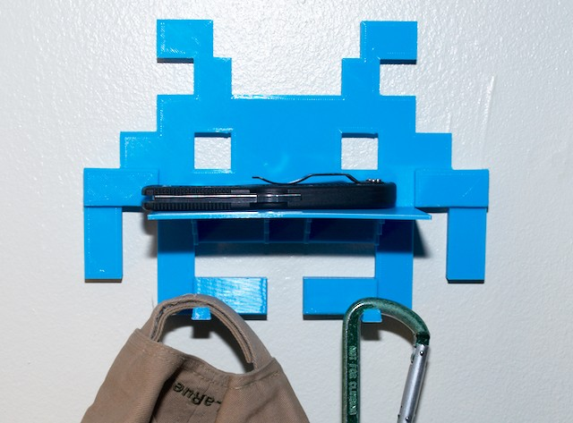 | 
| --- | --- | 

Key Design Features
---

* **Personalize**: Choose from all the classic invaders. 
* **Accesorize**: Many accesories to fit your needs 
* **Mix & Match**: Completely modular! tens of thousands of combinations
* **No Hardware!** (Other than two screws for base plate to drywall)
* All to scale, designed so everything fits on a 225x225 print surface. 

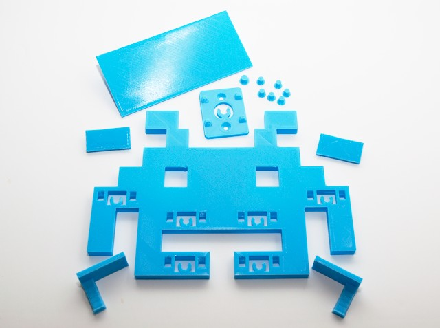

Invaders
---

<table width="100%">
<tr>
<td align="center" width="40%"> 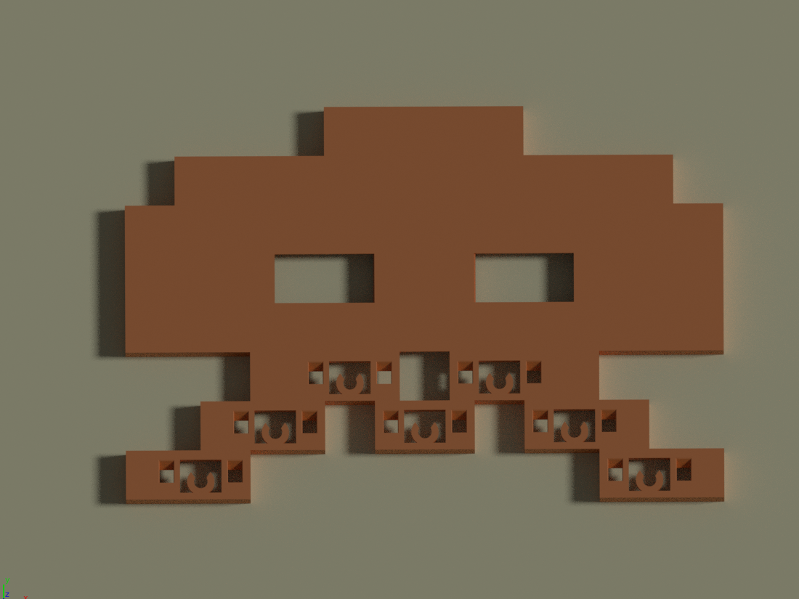</td>
<td align="center" width="15%"> 12x8 7 mounts</td>
<td align="center" width="45%"> Lowest tier invader, holds the most stuff.  <i>Isn't that always the case when you're the lowest tier?</i></td>
</tr>
<tr>
<td align="center" width="40%"> 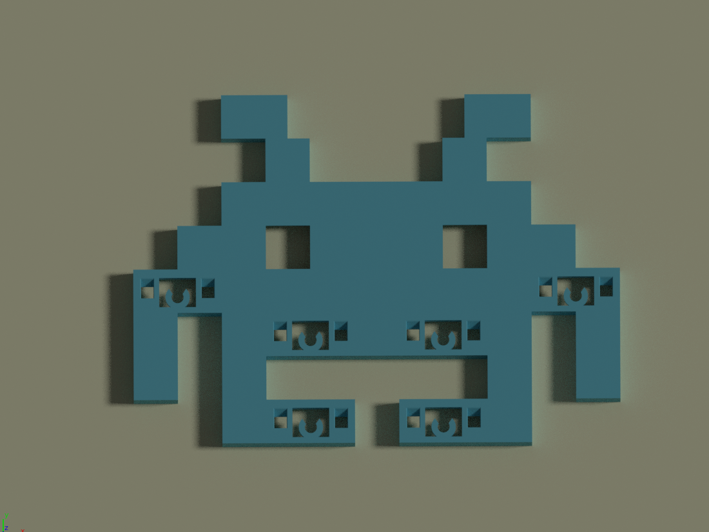</td>
<td align="center" width="15%"> 11x8 6 mounts</td>
<td align="center" width="45%"> The "Jumping Jack" invader, arguabley the most memorable from the game. </td>
</tr>
<tr>
<td align="center" width="40%"> 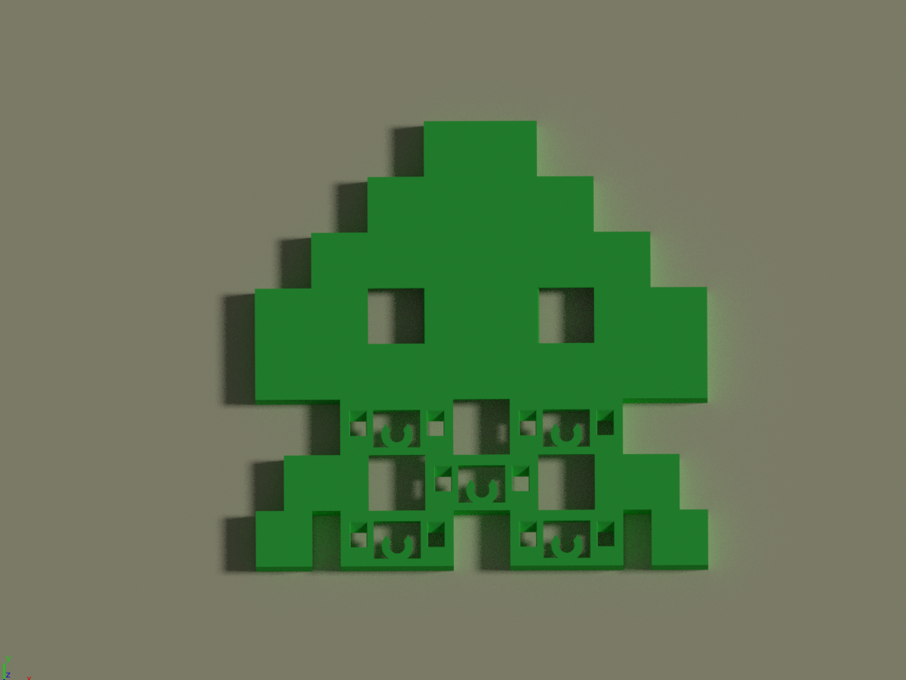</td>
<td align="center" width="15%"> 8x8 5 mounts</td>
<td align="center" width="45%"> The Lundberg of invaders, holds the least amount of stuff.  Is always the last to sneak up on you just when you thought you had the level beat.<td>
</tr>
</table>

Accessories
---

Not shown, a wall mount and mounting pins are also included. All accessories use the 5mm mounting pin where the wall mount uses the original 6mm pin.  

<table width="100%">
<tr>
<th width="40%">Acc</th>
<th width="60%" align="center">Description</th>
</tr>
<tr>
<td>  </td>
<td align="center"> Cover   2x1    Decorative cover plate </td>
</tr>
<tr>
<td>  </td>
<td align="center"> Hook   2x1    Single centered hook</td>
</tr>
<tr>
<td > 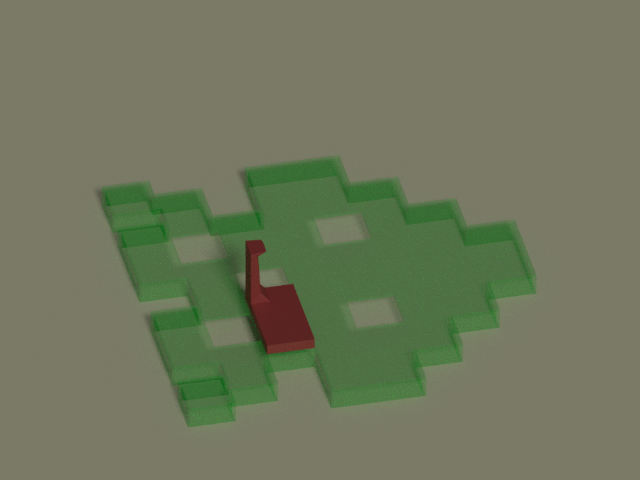 </td>
<td align="center" > Hook Right   2x1    Single hook offset right</td>
</tr>
<tr>
<td > 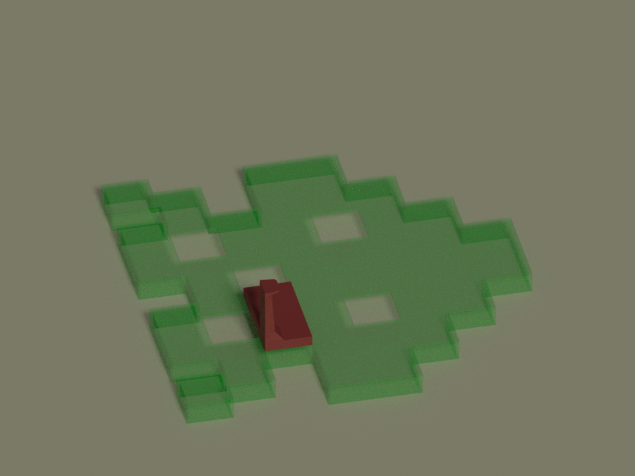 </td>
<td align="center" > Hook Left  2x1    Single hook offset left</td>
</tr>
<tr>
<td > 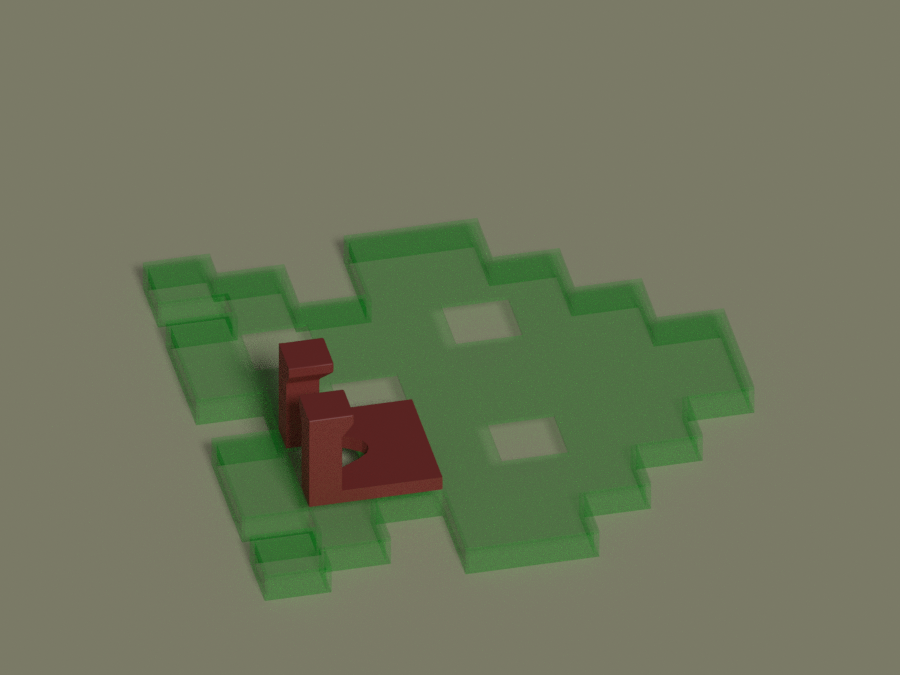 </td>
<td align="center" > Headphone Hanger   2x2    Holds headphones, was designed for the Bose QC 30 but should work with many others.<td>
</tr>
<tr>
<td > 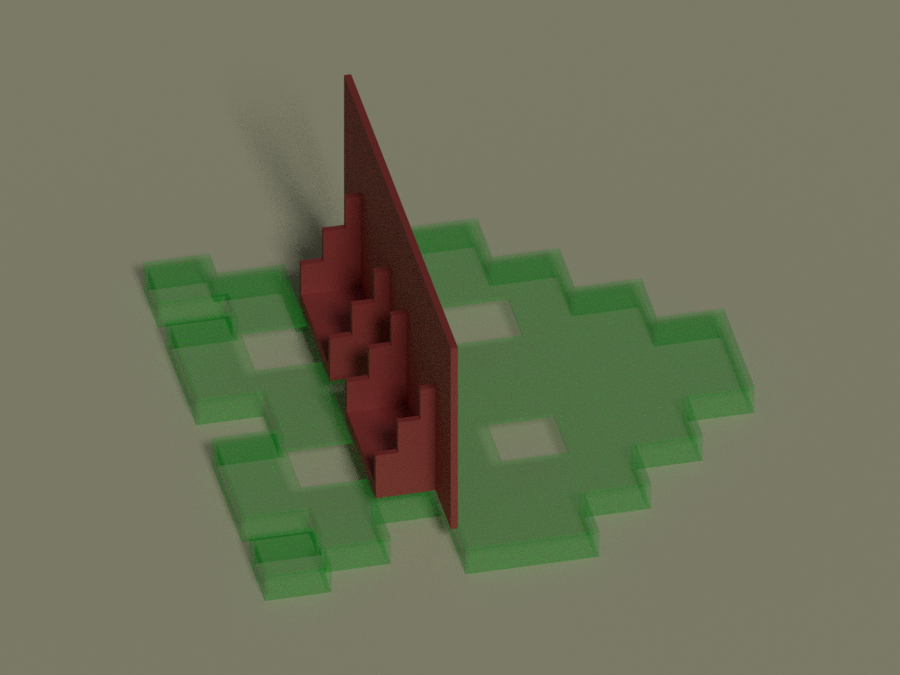 </td>
<td align="center" > Shelf   7x1    A gravity operated anti movement device.   <i>requires two mount points with single space between</i></td>
</tr>
</table>

Mounting System
---
Attachment mechanisms for this project are based upon this design.  
[Delta mount](https://www.youmagine.com/designs/deltamount).

1. Insert the pin 
2. Set tabs into notches 
3. Slide down to lock

| 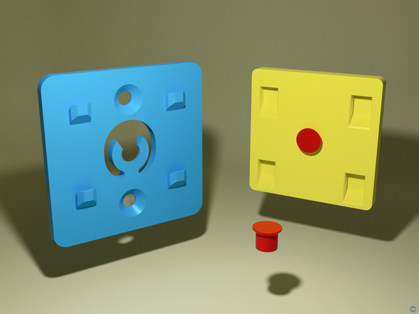 | 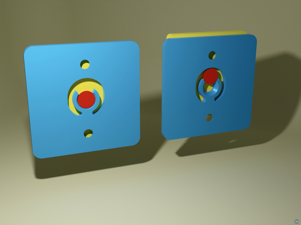 |
| --- | --- |

Print Execution
---
These are large flat prints for the majority of the print time and present all the associated challenges. Please read this [Printing Tips for Glass Beds](https://www.thingiverse.com/thing:4090002) if you are having trouble with adhesion, warping, scaring, etc. 

### Settings
| Print Setting | Value |
| --- | --- |
| Material | PLA |
| Initial Layer Height | 0.24 |
| Layer Height | 0.2 |
| Build Plate Adhesion | Brim (4mm) |
| Top Layers | 5 |
| Bottom Layers | 5 | 
| Wall | 3 |
| Supports | yes (only for accessories printed vertically) |

Appendix
---

### Resources
Delta Mount:
https://www.youmagine.com/designs/deltamount

### Misc Design Notes
Keen eyed video game purists will notice that I've taken liberties with a pixel here and there to make the characters printable and to allow space for hangers. Models were created in blender are are based on 18.5mm per pixel.

### Notes on Scaling
Full disclosure I had some trouble scaling these in Cura, I think the problem is that Belnder isn't the best at joining parts cleanly, your results may vary. To maintain accuracy scale parts along consistent dimensions. 

TL;DR: scale 10,20,and 30 pt invaders to equal height. 

